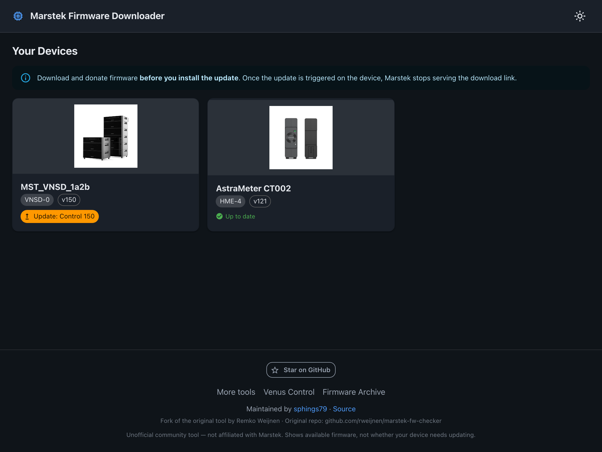
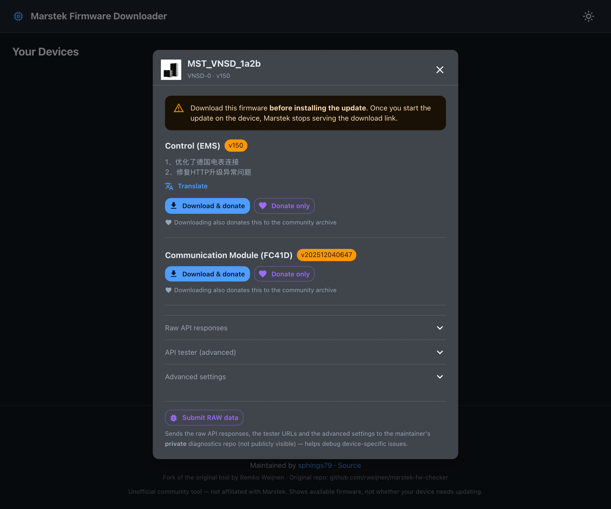
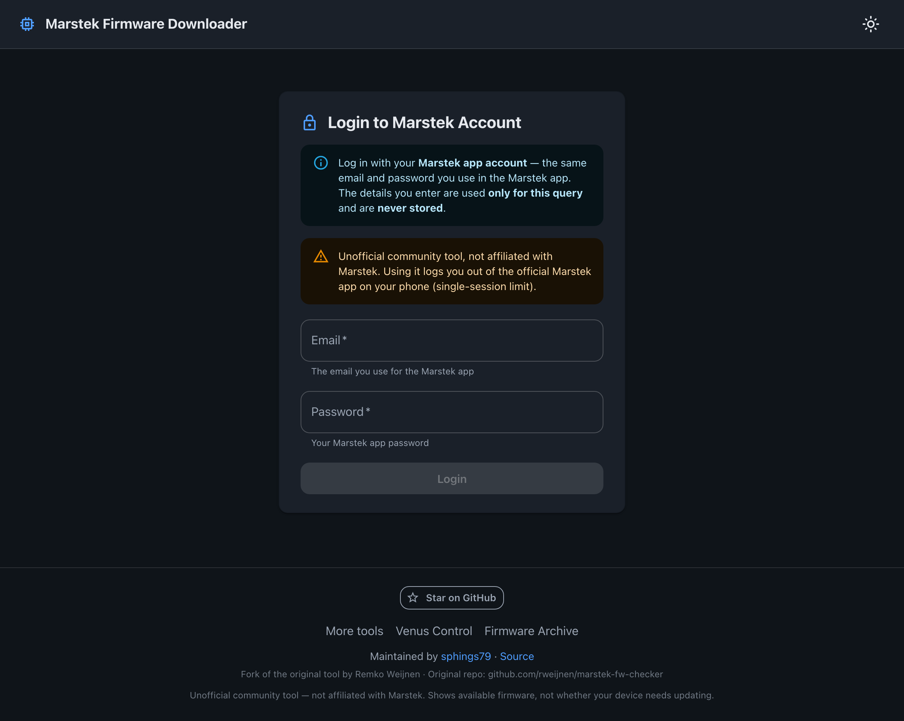
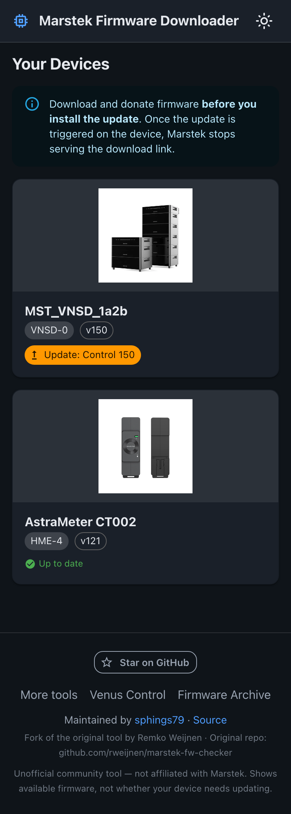

# Marstek Firmware Downloader

A modern, mobile-friendly web tool to **check, download and archive firmware** for
Marstek Venus / B2500 devices. Log in with your Marstek app account, see which
firmware updates are available, download them **before** you install the update,
and optionally donate them to a community firmware archive.

> **Unofficial community tool** — not affiliated with, endorsed by, or supported by
> Marstek. Use at your own risk.

**Hosted:** <https://sphings-dev.de/marstek/marstek-fw-checker/>

<p align="center">
  <a href="https://github.com/sphings79/marstek-fw-checker">
    
  </a>
</p>

---

## Screenshots

<p align="center">
  
</p>

<p align="center">
  
  
</p>

<p align="center">
  
</p>

<p align="center"><em>Fully responsive (desktop &amp; mobile) and theme-aware (light &amp; dark).</em></p>

---

## What it does

- 🔐 **Login with your Marstek app account** — the same email + password. Credentials
  are only used for the query and are **never stored**.
- 📱 **Device overview** — each device card shows its product image and checks for
  updates in the background: **✓ Up to date** or **⬆ Update: Control 150, …** (the new
  version, like the app shows it).
- 📦 **Per-module firmware** — Control (EMS), BMS, MPPT, Inverter (Micro) and CT
  devices, each with its own version, release notes and download.
- 📡 **FC41D communication module** — download the WLAN-module `.rbl` firmware and
  donate it to the archive.
- ⬇️ **Download & donate in one click** — downloading also contributes the firmware
  to the community archive (a separate *Donate only* button exists too).
- 🌐 **Release-note translation** — Chinese notes translate to English on demand.
- 🌗 **Light / dark mode** toggle (remembers your choice).
- 🛠️ **Power-user tools** — raw API responses, an editable API tester, read-only
  advanced device settings, and a *Submit RAW data* button that sends a diagnostic
  dump to a **private** repo (not public) to help debug device-specific issues.

> **Important:** firmware can only be secured **while the update has not been
> installed yet**. Once you trigger the update on the device, Marstek stops serving
> the download link — so download/donate **before** updating.

---

## Supported devices

| Device | Type code |
|--------|-----------|
| Marstek Venus D | `VNSD-0` |
| Marstek Venus A | `VNSA-0` |
| Marstek Venus E 3.0 (V3) | `VNSE3-0` |
| Marstek Venus E (V1 / V2) | `HMG-50` |
| Marstek Venus C | `HMG-25` |
| Marstek B2500-D | `HMJ-2` |
| Marstek smart meter / CT (e.g. CT002, P1) | `HME-3`, `HME-4` |
| FC41D Wi-Fi / communication module | firmware type on Venus / B2500 |

Development and testing focus on the **Venus D (VNSD-0)**. Other models use the same
Marstek cloud API and are supported on a best-effort basis — if your device isn't
listed but appears in your Marstek account, it will very likely still work.

---

## Installing a firmware version

This tool **downloads and archives** firmware — it does **not** flash it onto the
device. To actually install a specific version manually, use **Venus Control**, the
sibling tool that performs firmware updates over **Bluetooth** (Control/EMS, BMS,
MPPT and Micro-Inverter modules):

**➡️ <https://sphings-dev.de/marstek/control/>** &nbsp;·&nbsp; source:
[github.com/sphings79/venuscontrol](https://github.com/sphings79/venuscontrol)

You can of course also let the **official Marstek app** apply the update — but once
you do, the download link disappears, so **download / donate the firmware here
first**.

---

## The firmware archive

Donated firmware is preserved in a companion repository so versions stay available
even if Marstek removes them:

**➡️ <https://github.com/sphings79/marstek-firmware-archiv>**

Submitting from this tool opens an issue there; a GitHub Action verifies and files
the firmware automatically (per device, module and version). Device names are
**anonymized** before anything leaves your browser.

---

## How it works

A **React + TypeScript + Vite + MUI** single-page app, plus a small **Node/Express**
backend that:

- proxies the Marstek cloud API (the browser can't call it directly — CORS), and
- talks to GitHub for the archive-donation / diagnostics features (needs a token).

```
Browser ── HTTPS ──> Apache (reverse proxy) ──> Node/Express :3000 ──> dist/ + API proxy
```

The device firmware itself is fetched straight from Marstek's CDN; the tool only
resolves the download URLs.

---

## Development

Requires Node.js ≥ 20.19.

```bash
npm install

# terminal 1 — backend (proxy + archive/diagnostics functions) on :3000
npm run server

# terminal 2 — Vite dev server on :5173 (proxies /.netlify/functions to :3000)
npm run dev
```

Then open <http://localhost:5173/marstek/marstek-fw-checker/>.

The archive-donation / diagnostics features need a `GITHUB_TOKEN` (see
[DEPLOY.md](DEPLOY.md)); login, update checking and downloads work without one.

Build the production bundle:

```bash
npm run build   # tsc + vite build -> dist/
```

### Regenerating the screenshots

The screenshots above use generic demo data (no real account) via a `?demo=` route
and Playwright — see [docs/screenshots.mjs](docs/screenshots.mjs).

---

## Deployment

See **[DEPLOY.md](DEPLOY.md)** — full from-scratch install, the GitHub token setup,
updating (`./deploy.sh`), and rollback.

---

## Privacy

- Your Marstek credentials are used only for the live query and are **never stored**.
- Device identifiers (ID, serial, MAC) and the device **name** are anonymized before
  any archive submission (users sometimes put real names in the device name).
- The token used for GitHub lives only on the server, never in the browser.

---

## Credits & license

- Maintained by **[sphings79](https://github.com/sphings79)**.
- Fork of the original tool by **Remko Weijnen** — original repo:
  `github.com/rweijnen/marstek-fw-checker`.
- Sibling project: **[Venus Control](https://sphings-dev.de/marstek/control/)** —
  cloud-free Bluetooth control panel for Marstek Venus.

MIT License.
